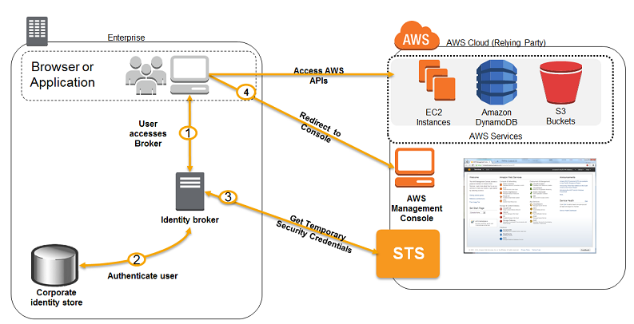

# AWS Solutions Architect Professional 2020

## Description

A compilation of active notes. The goal was to actively listen and memorize while noting, so these aren't ideal for at-a-glance studying. 


[TOC]

## Identity and Federation

### IAM Roles

**Types**

- EC2 Instance
- Service Roles (API gateway, etc)
- Cross Account Roles

**Policies**

- AWS Managed
- Customer Managed
- Inline Policies

**Caveats**

Deny overrides allow. Use Effect: Allow and NotAction to work around.

#### Conditions

**Syntax**

```
"Condition" : { "{condition-operator}" : { "{condition-key}" : "{condition-value}" }}
```

**Operators**

```
• String (StringEquals, StringNotEquals, StringLike...)
	• "Condition": {"StringEquals": {"aws:PrincipalTag/job-category": "iamuser-admin"}}
	• "Condition": {"StringLike": {"s3:prefix": [ "", "home/", "home/${aws:username}/" ]}}
• Numeric (NumericEquals, NumericNotEquals, NumericLessThan...)
• Date (DateEquals, DateNotEquals, DateLessThan...)
• Boolean (Bool):
	• “Condition": {"Bool": {"aws:SecureTransport": "true"}}
	• "Condition": {"Bool": {"aws:MultiFactorAuthPresent": "true"}}
• (Not)IpAddress:
	• "Condition": {"IpAddress": {"aws:SourceIp": "203.0.113.0/24"}}
• ArnEquals, ArnLike
	• Null: "Condition":{"Null":{"aws:TokenIssueTime":"true"}}
```

#### Policies and Tags

```json
Example: ${aws:username}
	"Resource":["arn:aws:s3:::mybucket/${aws:username}/*"]
AWS Specific:
	• aws:CurrentTime, aws:TokenIssueTime, aws:principaltype, aws:SecureTransport, 			aws:SourceIp, aws:userid, ec2:SourceInstanceARN
Service Specific:
	• s3:prefix, s3:max-keys, s3:x-amz-acl, sns:Endpoint, sns:Protocol...
Tag Based:
	• iam:ResourceTag/key-name, aws:PrincipalTag/key-name...
```

**Username**

```
"Resource":["arn:aws:s3:::mybucket/${aws:username}/*"]
```

**AWS Specific**

```
aws:CurrentTime, aws:TokenIssueTime, aws:principaltype, aws:SecureTransport, aws:SourceIp, aws:userid, ec2:SourceInstanceARN
```

**Service Specific**

```json
s3:prefix, s3:max-keys, s3:x-amz-acl, sns:Endpoint, sns:Protocol...
```

**Tag Based**

```
iam:ResourceTag/key-name, aws:PrincipalTag/key-name...
```

#### IAM Roles vs Resource Based Policies

**Principal Role**

The Role assumed overrides any previous roles or permissions of the user, application, or service. 

**Resource Based Policy**

The prinicpal doesn't require any previous permissions.

------

## Security Token Service (STS)

### Overview

- Temporary security credentials
- Uses AssumeRole API
- Can switch roles within AWS accounts that you own
- Use IAM Access Analyzer

### STS APIs

| API                       | Description                                               |
| ------------------------- | --------------------------------------------------------- |
| AssumeRole                | Internal/cross-account.                                   |
| AssumeRoleWithSAML        | Same via SAML.                                            |
| AssumeRoleWithWebIdentity | via  IdP federation or Congnito federation (recommended). |
| GetSessionToken           | for MFA.                                                  |
| GetFederationToken        | temporary credentials for a federated user.               |

### Cross Account Access

**First-Party Cross Account Access**

Suppose you have two Accounts, Production and Development, and wish to grant development users access to a resource. This is ***inside your*** ***Zone of Trust.***

1. **On production account: ** Create a role that grants developer account access.
2. **On Development account**: Grant a group or users permission to assume the role.


**Third-Party Cross Account Access**

Suppose you hire a consulting group and would like them to be able to access resources but don't want to manage an additional IAM user. This is ***outside the Zone of Trust.***

**Requires:**

- 3rd Party AWS Account ID
- An External ID (unique, secret, and chosen by third party)
  - Unique
  - Secret between your account and third-party account.
  - Chosen by third party.
  - Prevents "Confused deputy" attacks and issues.
- Define permissions in IAM policy.

**Process:**

1. Account A provides role to Account B.
2. Account B assumes role using the External ID.

------

### Identity Federation

Allows users outside of AWS to assume temprary roles for accessing AWS resources. This eliminates the need of creating and managing IAM users.

#### Methods

- SAML 2.0
- Custom Identity Broker
- Web Identity Federation (with or without Cognito)
- SSO
- Non-SAML with AWS Microsoft AD


#### SAML 2.0 Federation

- Integrate AD/ADFS with AWS
- Provides access to AWS Console/CLI
- Enables web-based cross-domain SSO
- Uses AssumeRoleWithSAML API
- Federation through SAML is on it's way out

**Process**


This example uses an app.

1. Client app makes request to IdP
2. IdP Authenticates user
3. Idp sends client SAML assertion
4. App calls AssumeRoleWithSAML (STS)
5. STS returns temporary credentials
6. App uses credentialls to access AWS resources

**Process - ADFS**

This example is for Console access and does not use an application.


1. User logs into portal via browser.
2. AD Identity Store authenticates user
3. Browser recieves SAML assertion
4. Browser posts SAML assertion to STS
5. STS returns credentials
6. Redirected to AWS Console


#### Custom Identity Broker

- Use *only if identity provider is not compatible with SAML 2.0*
- Identity broker determines the appropriate IAM policy
- Uses AssumeRole or GetFederationToken APIs.

**Process**



1. User accesses Identity Broker
2. Identity broker authenticates user with the Corporate Identity Store.
3. Identity broker retrieves credentials from STS.
4. Browser/App recieves access to AWS APIs and is redirected to the AWS console.


#### Web Identity Federation - AssumeRoleWithWebIdentity

Remember, this is not recommended by AWS.

**Process**


#### Web Identity Federation - Cognito

- Preferred way for WIF
- Cognito:
  - Supports anonymous users
  - Supports MFA
  - Data synchronization

**Process**


1. A customer starts app
2. Redirects to Login with Amazon and recieves an ID token
3. App uses Cognito to exchange ID token for Cognito token
4. App uses STS to exchange Cognito token for AWS credentials
5. Appp uses credentials to access AWS resources

**IAM Policy**

IAM Policies can identify users via IAM policy variables.

- cognito-identity.amazonaws.com:sub
- www.amazon.com:user_id
- graph.facebook.com:id
- accounts.google.com:sub

```json
"Condition": {"StringLike": {"s3:prefix": ["Amazon/appname/${www.amazon.com"iser_id}/*"]}}
```


#### Active Directory Federation Services

Similar to previous Identity Federation Providers, but ADFS is privately managed by the business or corporation. 

**Process**


1. User browses to URL with ADFS authentication
2. ADFS authenticates user with Active Directory
3. The browser recieves an AuthN response
4. Browser sends POST to AWS, passing the AuthN response
5. Browser is redirected to Console

------

### AWS Directory Services

If you don't know anything about Active Directory:

- Central database of objects, users, computers, file shares, and security groups
- Central security, account, and permission management
- Objects organized in *trees*; groups of objects called *forests*.


## AWS Organizations

## AWS Resource Access Manager - RAM

## AWS SSO

****